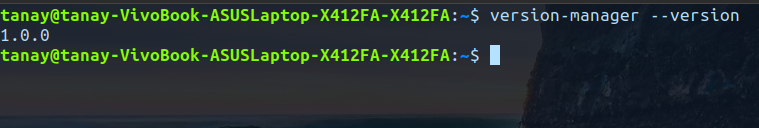
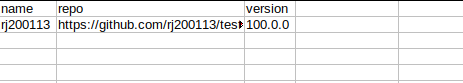
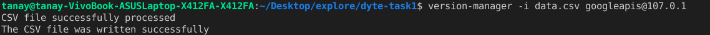
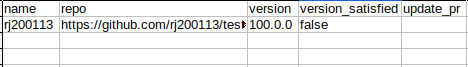
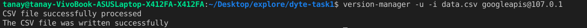
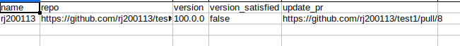

[](https://classroom.github.com/online_ide?assignment_repo_id=7948246&assignment_repo_type=AssignmentRepo)

<div id="top"></div>
<!--
*** Thanks for checking out the Best-README-Template. If you have a suggestion
*** that would make this better, please fork the repo and create a pull request
*** or simply open an issue with the tag "enhancement".
*** Don't forget to give the project a star!
*** Thanks again! Now go create something AMAZING! :D
-->

<!-- PROJECT SHIELDS -->
<!--
*** I'm using markdown "reference style" links for readability.
*** Reference links are enclosed in brackets [ ] instead of parentheses ( ).
*** See the bottom of this document for the declaration of the reference variables
*** for contributors-url, forks-url, etc. This is an optional, concise syntax you may use.
*** https://www.markdownguide.org/basic-syntax/#reference-style-links
-->

<!-- PROJECT LOGO -->
<br />
<div align="center">
  <a href="https://github.com/github_username/repo_name">
    
  </a>

<h3 align="center">Version Manager CLI</h3>

  <p align="center">
    A CLI tool to automatically creating PR for updated version of the specified dependency
    <br />
    <a href="https://github.com/dyte-submissions/dyte-vit-2022-tanay13"><strong>Explore the docs »</strong></a>
    <br />
    <br />
    <a href="https://github.com/dyte-submissions/dyte-vit-2022-tanay13">View Demo</a>
    ·
    <a href="https://github.com/dyte-submissions/dyte-vit-2022-tanay13/issues">Report Bug</a>
    ·
    <a href="https://github.com/dyte-submissions/dyte-vit-2022-tanay13/issues">Request Feature</a>
  </p>
</div>

<!-- TABLE OF CONTENTS -->
<details>
  <summary>Table of Contents</summary>
  <ol>
    <li>
      <a href="#about-the-project">About The Project</a>
      <ul>
        <li><a href="#built-with">Built With</a></li>
      </ul>
    </li>
    <li>
      <a href="#getting-started">Getting Started</a>
      <ul>
        <li><a href="#prerequisites">Prerequisites</a></li>
        <li><a href="#installation">Installation</a></li>
      </ul>
    </li>
    <li><a href="#usage">Usage</a></li>
    <li><a href="#roadmap">Roadmap</a></li>
    <li><a href="#contributing">Contributing</a></li>
    <li><a href="#license">License</a></li>
    <li><a href="#contact">Contact</a></li>
    <li><a href="#acknowledgments">Acknowledgments</a></li>
  </ol>
</details>

<!-- ABOUT THE PROJECT -->

## About The Project

Version Manager is a CLI tool writted in nodejs to update projects specified dependencies to the given version.
Using Command Line Interface we can input the `csv` file and the `package@version`.
After taking the above values the tool will use github API to fetch the content of package.json of all the given repos. It will then perform a version check to check whether the version present in the repo is greater than or equal to the given version.
Accordingly we then write the datas in the same csv file.

The tool will fork the remote project and create a new `version-update` branch in it. In the `version-update` branch the package.json file will be modified and a PR will be created for the default branch of the remote repo.

<p align="right">(<a href="#top">back to top</a>)</p>

### Built With

- [Node.js](https://nodejs.org/en/)
- [Commander JS](https://www.npmjs.com/package/commander)
- [CSV writer](https://www.npmjs.com/package/csv-writer)
- [CSV parser](https://www.npmjs.com/package/csv-parser)
- [Github API](https://docs.github.com/en/rest)

<p align="right">(<a href="#top">back to top</a>)</p>

<!-- GETTING STARTED -->

## Getting Started

To get a local copy up and running follow these simple example steps.

### Prerequisites

Run the following command in you command line to get the latest version of NPM

- npm
  ```sh
  npm install npm@latest -g
  ```

### Installation

1. Get a free personal access token at [https://github.com/settings/tokens](https://github.com/settings/tokens)

2. Clone the repo
   ```sh
   git clone https://github.com/dyte-submissions/dyte-vit-2022-tanay13.git
   ```
3. navigate to the directory

   ```sh
   cd dyte-vit-2022-tanay13
   ```

4. Install NPM packages
   ```sh
   npm install
   ```
5. Create an .env file and enter the following data

   ```
   GITHUB_TOKEN=${YOUR_TOKEN}

   ```

6. Link the CLI locally

   ```sh
   npm link
   ```

<p align="right">(<a href="#top">back to top</a>)</p>

<!-- USAGE EXAMPLES -->

## Usage

After Linking the tool. Use the given commands

- To get the version
  ```sh
  version-manager --version
  ```
- 

<br>

- Input CSV
- 

- To take input of the csv and package version
- ```sh
  version-manager -i /path/of/csvfile packageName@version
  ```
- <b>Example</b>

- 

- CSV file state
- 

<br>

- To take the input and open a PR for the outdated versions
- ```sh
  version-manager -u -i /path/of/csvfile packageName@version
  ```
- <b>Example</b>

- 

- CSV file state
- 

<!-- CONTRIBUTING -->

## Contributing

Contributions are what make the open source community such an amazing place to learn, inspire, and create. Any contributions you make are **greatly appreciated**.

If you have a suggestion that would make this better, please fork the repo and create a pull request. You can also simply open an issue with the tag "enhancement".
Don't forget to give the project a star! Thanks again!

1. Fork the Project
2. Create your Feature Branch (`git checkout -b feature/AmazingFeature`)
3. Commit your Changes (`git commit -m 'Add some AmazingFeature'`)
4. Push to the Branch (`git push origin feature/AmazingFeature`)
5. Open a Pull Request

<p align="right">(<a href="#top">back to top</a>)</p>

<!-- LICENSE -->

## License

Distributed under the MIT License. See `LICENSE.txt` for more information.

<p align="right">(<a href="#top">back to top</a>)</p>

<!-- CONTACT -->

## Contact

Your Name - [@twitter_handle](https://twitter.com/tanayhere) - tanay.raj76@gmail.com

Project Link: [https://github.com/dyte-submissions/dyte-vit-2022-tanay13](https://github.com/dyte-submissions/dyte-vit-2022-tanay13)

<p align="right">(<a href="#top">back to top</a>)</p>

<p align="right">(<a href="#top">back to top</a>)</p>

<!-- MARKDOWN LINKS & IMAGES -->
<!-- https://www.markdownguide.org/basic-syntax/#reference-style-links -->

[contributors-shield]: https://img.shields.io/github/contributors/github_username/repo_name.svg?style=for-the-badge
[contributors-url]: https://github.com/github_username/repo_name/graphs/contributors
[forks-shield]: https://img.shields.io/github/forks/github_username/repo_name.svg?style=for-the-badge
[forks-url]: https://github.com/github_username/repo_name/network/members
[stars-shield]: https://img.shields.io/github/stars/github_username/repo_name.svg?style=for-the-badge
[stars-url]: https://github.com/github_username/repo_name/stargazers
[issues-shield]: https://img.shields.io/github/issues/github_username/repo_name.svg?style=for-the-badge
[issues-url]: https://github.com/github_username/repo_name/issues
[license-shield]: https://img.shields.io/github/license/github_username/repo_name.svg?style=for-the-badge
[license-url]: https://github.com/github_username/repo_name/blob/master/LICENSE.txt
[linkedin-shield]: https://img.shields.io/badge/-LinkedIn-black.svg?style=for-the-badge&logo=linkedin&colorB=555
[linkedin-url]: https://linkedin.com/in/linkedin_username
[product-screenshot]: images/screenshot.png
